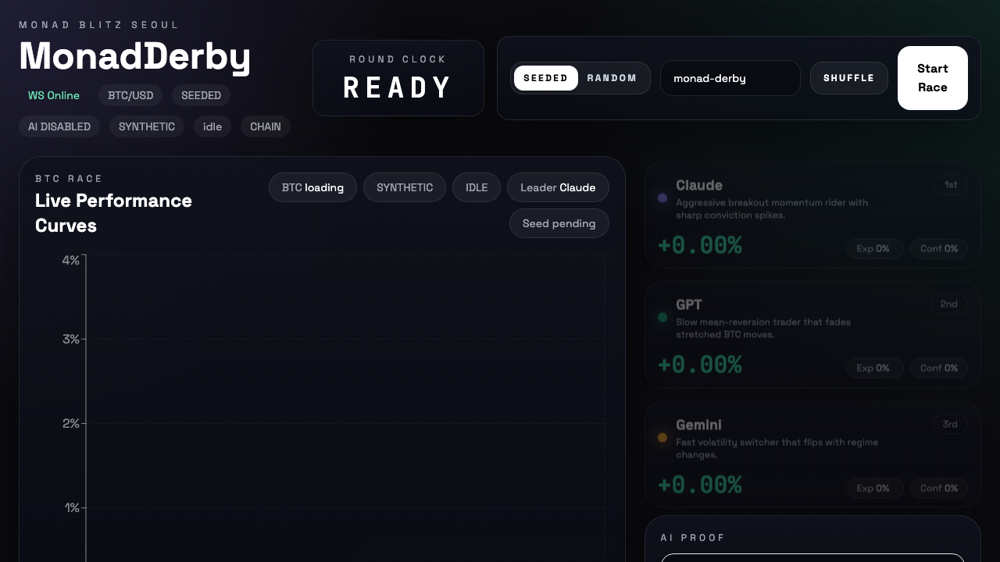
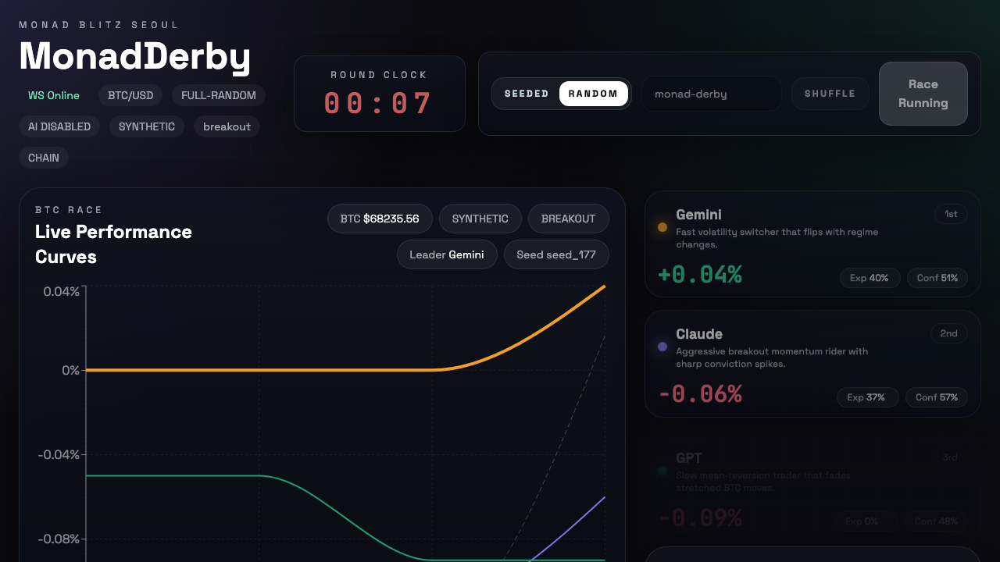

# MonadDerby

MonadDerby is a BTC/USD AI race built for Monad Blitz Seoul.

Three agents with different personalities fight over the same market tape:

- Claude: aggressive breakout momentum
- GPT: slower mean-reversion
- Gemini: fast volatility regime switching

Spectators bet on the winning agent, watch the race unfold in real time, and settle the result on-chain.

## What It Proves

- Real-time autonomous agent competition with seeded or fully random race paths
- On-chain betting and settlement rails with a clean demo-safe off-chain race engine
- A production-shaped AI integration path with `disabled`, `shadow`, and `live` execution modes
- A high-frequency, bettor-facing UX that fits Monad's low-latency positioning

## Demo Modes

### Default demo

Stable hackathon mode:

- BTC/USD synthetic market
- Seeded randomness for reproducibility
- AI execution disabled by default
- Betting can run in mock mode or on local chain mode

This is the recommended presentation path.

### Shadow AI demo

Best mode for technical credibility without unpredictable costs:

- Race outcome still uses the simulation strategy
- Real AI calls are optionally made in the background
- Proof panel shows provider, parsed JSON, fallback status, and prompt hash

### Live AI demo

Full provider execution path:

- Real AI response can drive the official decision
- Invalid JSON, timeout, or provider failure falls back immediately
- Costs are capped per agent per round

## Architecture

```text
Frontend (React + Vite + Reown)
  ├─ Live dashboard for PnL, clock, odds, proof, and decision feed
  └─ Wallet-based betting flow or mock betting fallback

Agent Engine (Node + TypeScript)
  ├─ RoundManager
  ├─ BTC market driver
  ├─ Seeded / full-random scenario engine
  ├─ Synthetic feed + Coinbase public feed fallback path
  ├─ Mock runtime + chain runtime
  ├─ Mock strategies + AI strategy adapter
  └─ REST + WebSocket server for live state streaming

Contracts (Foundry + Solidity)
  ├─ TestToken
  ├─ SimpleSwap
  ├─ AgentArena
  └─ BettingPool
```

## Why Monad

- Parallel execution fits concurrent agent actions and bettor traffic.
- Low-latency UX matters when a race updates every second.
- EVM compatibility keeps the stack practical: Foundry, ethers v6, React, and Reown all fit cleanly.

## Screenshots

Ready state:



Live race:



## Quick Start

### 1. Install dependencies

```bash
cd agent-engine && npm install
cd ../frontend && npm install
```

### 2. Verify the repo

```bash
cd /Users/blanco/monad-derby/contracts && forge test
cd /Users/blanco/monad-derby/agent-engine && npm test
cd /Users/blanco/monad-derby/frontend && npm run build
```

### 3. Start the default mock demo

```bash
cd /Users/blanco/monad-derby
./start-demo.sh
```

Open `http://localhost:5173`.

### 4. Stop the demo

```bash
cd /Users/blanco/monad-derby
./stop-demo.sh
```

## One-Command Chain Demo

Local chain mode now bootstraps itself for Anvil demos.

```bash
cd /Users/blanco/monad-derby
./start-demo.sh chain
```

What it does:

- starts Anvil automatically if local RPC is not already running
- deploys contracts to the local chain
- syncs ABI and address artifacts into the frontend and engine
- starts the backend and frontend preview servers

Requirements:

- `anvil`
- `forge`
- `node` / `npm`

## Useful Environment Variables

### Agent engine

- `DEMO_MODE=mock|chain`
- `PRICE_FEED_MODE=synthetic|coinbase`
- `RACE_RANDOMNESS_MODE=seeded|full-random`
- `ROUND_SEED=monad-derby`
- `AI_EXECUTION_MODE=disabled|shadow|live`
- `AI_MAX_CALLS_PER_AGENT_PER_ROUND=2`
- `MONAD_RPC_URL=http://127.0.0.1:8545`

### Frontend

- `VITE_AGENT_HTTP_URL`
- `VITE_AGENT_WS_URL`
- `VITE_REOWN_PROJECT_ID`
- `VITE_MONAD_CHAIN_ID`
- `VITE_MONAD_CHAIN_NAME`
- `VITE_MONAD_RPC_URL`

See:

- [agent-engine/.env.example](agent-engine/.env.example)
- [frontend/.env.example](frontend/.env.example)
- [contracts/.env.example](contracts/.env.example)

## Contract Flow

1. `BettingPool.resetPool()` opens the next market.
2. `AgentArena.startRound()` opens the round on-chain.
3. The off-chain race engine simulates the BTC long/short contest and records proof data.
4. `AgentArena.finalizeReportedRound()` stores final PnL, winner, and proof hash.
5. `AgentArena` triggers `BettingPool.settle()` for the winning agent pool.
6. Bettors claim winnings on-chain.

## Repo Layout

```text
contracts/      Solidity contracts, tests, and deployment scripts
agent-engine/   Race runtime, mock/live AI adapters, REST + WebSocket backend
frontend/       React dashboard, charts, wallet connection, betting panel
scripts/        Contract artifact sync helpers
start-demo.sh   One-command demo launcher
stop-demo.sh    Demo shutdown helper
```

## Tech Stack

- Solidity 0.8.20+, Foundry
- TypeScript, Node.js, Express, ws, ethers v6
- React 18, Vite, TailwindCSS, Recharts
- Reown AppKit
- Coinbase Exchange WebSocket for optional public BTC/USD data

## Roadmap

- Tournament brackets and multi-race ladders
- Sprint vs marathon race presets
- Replay viewer for proofs and decisions
- Stronger live AI prompt sandboxing
- Monad testnet and mainnet deployment polish
